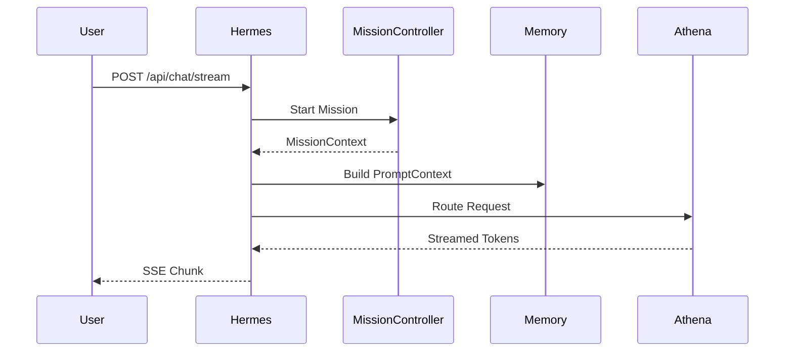
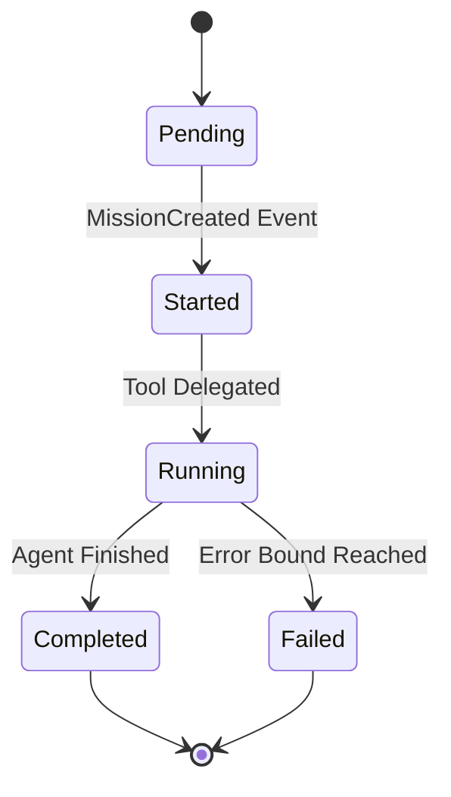
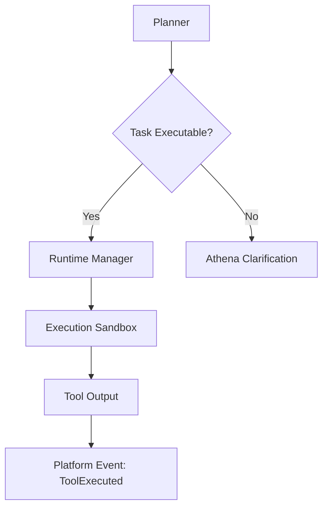
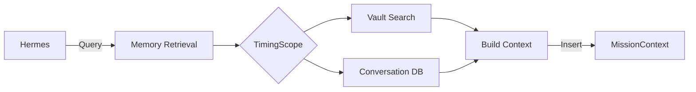
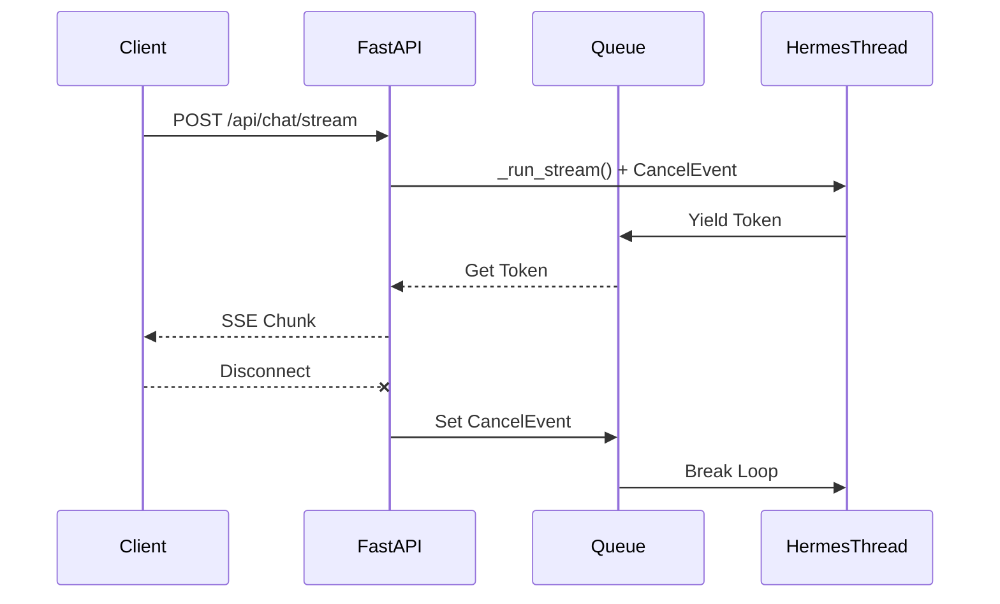

# JARVIS Architecture

JARVIS is a production-grade AI Operating System designed as an event-driven intelligence pipeline.

## Core Principles
1. **Stateless Subsystems**: All state is managed by `MissionContext` and `MemoryService`.
2. **Event-Driven**: Frontend observes state; Backend publishes state via WebSockets (`PlatformEvent`).
3. **Pydantic Contracts**: Strict JSON validation boundaries for all intra-system transitions.

## Hermes Pipeline
The Hermes Pipeline is the entry point for all asynchronous operations, delegating intent to Athena and tasks to the Mission Controller.

## Mission Lifecycle
Missions represent discrete units of agentic execution. They transition linearly and cannot be re-opened.

## Runtime Flow
The Sandbox handles tool execution in isolation.

## Memory Flow

## Chat Streaming Flow
Handling client-disconnects safely to avoid token leakage.

